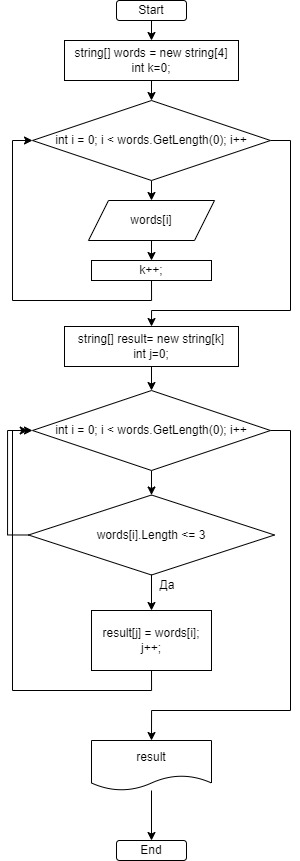

## Контрольная работа

### Задание
Написать программу, которая из имеющегося массива строк формирует массив из строк, длина которых меньше либо равна 3 символа.

### Решение
В цикле for пройтись по всем объектам массив проверяя длину каждого. Если объект подходит под описание задачи, то помещать его в результируйщий массив.

**Блок-схема**

